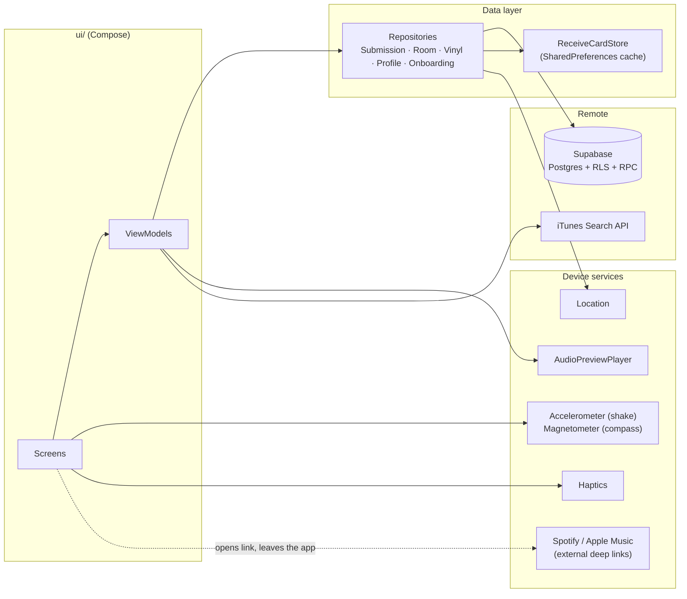
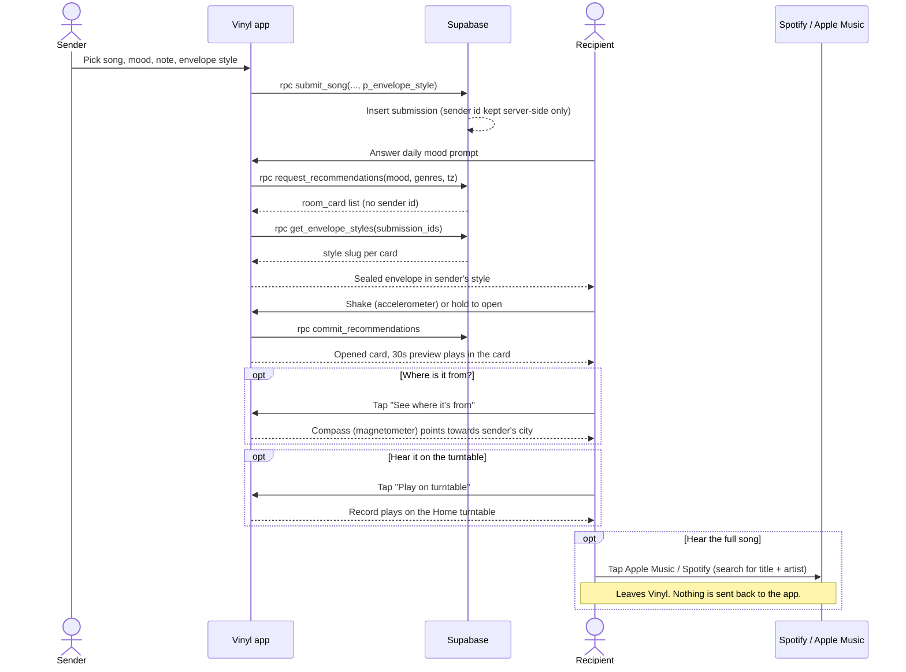
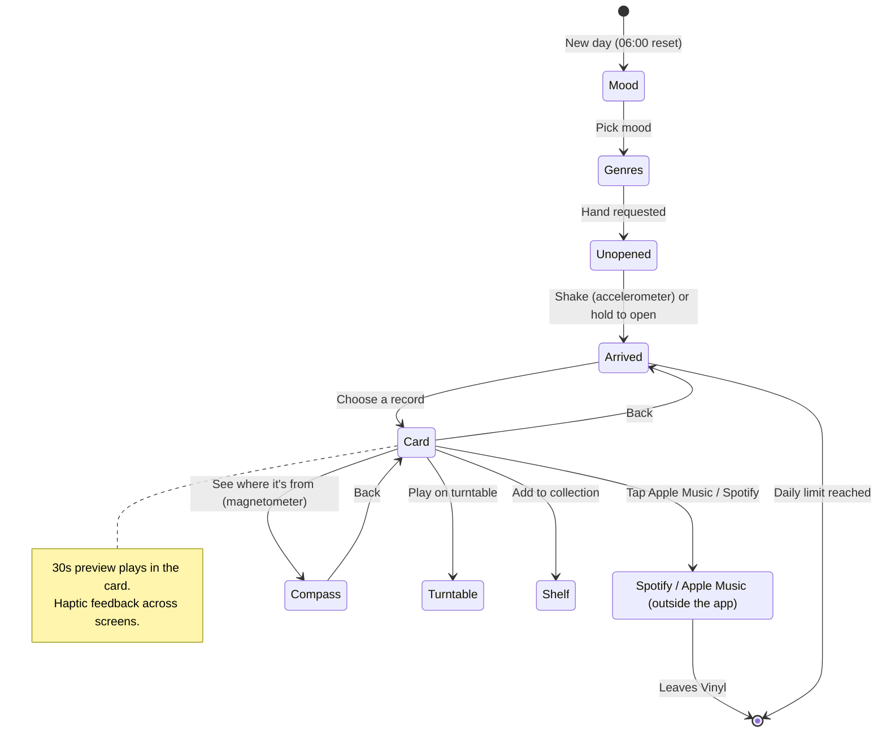
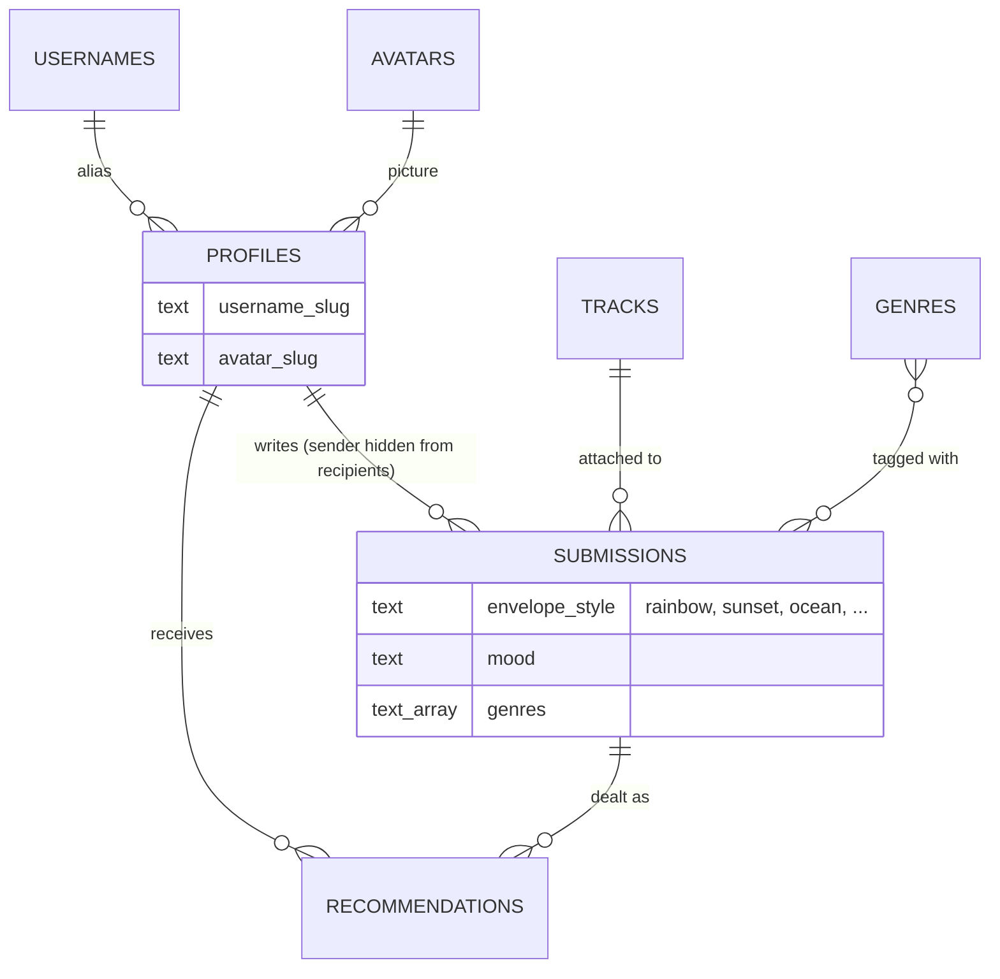

# Vinyl

Vinyl is an anonymous music-connection Android app. You write a short card with a song, a mood and a note, and it is delivered to a stranger. Each day you answer a mood prompt, get a hand of records matched to you, and open them by shaking or holding the envelope. Records you keep go on your Record Shelf. Senders are never identified to recipients.

## Tech Stack & Features
- **UI**: Jetpack Compose (Material Design 3), with custom Canvas drawing for envelopes, the turntable and vinyl sleeves
- **Backend & Auth**: Supabase (Postgres, RLS, RPC functions) and Google Sign-In
- **Onboarding**: pick a pre-generated username, an avatar and favourite genres, then set up location and notifications
- **Daily matching**: mood-based recommendations through Supabase RPCs, with a daily pull limit that resets at 06:00 local time and a daily reminder notification
- **Envelope styles**: the sender picks one of 8 styles (Rainbow, Sunset, Ocean, Berry, Cute, Midnight, Simple, Sweetheart) when writing. It is stored as a slug on the submission and shown to the recipient on the unopened-record screen. Styles are drawn in code, not image files.
- **Accelerometer**: shake the sealed envelope to open it. A deliberate shake means 3 jolts above 2.7g within a second; there is also a long-press and an "Open it now" button, with TalkBack actions.
- **Magnetometer compass**: "See where it's from" opens a compass whose needle points towards the sender's city. It corrects for magnetic declination using your saved location, smooths the heading, counts down the degrees to go, and buzzes once when you line up. It uses the rotation-vector sensor where available and falls back to accelerometer + magnetometer. Devices with no compass sensor see an "unavailable" state instead of crashing.
- **30s preview in the card**: the opened card plays a 30s preview in place, with a countdown and progress line
- **Play on turntable**: sends the record to the Home turntable, with a now-playing panel and progress bar
- **Full song, outside the app**: the Apple Music and Spotify buttons open a search for the song's title and artist in that app (or the browser). This leaves Vinyl, and the app has no way to return you automatically.
- **Haptics**: tactile feedback on interactions across the app, including the compass lock-on and the turntable
- **Location**: city lookup and distance, so a card can show the sender's city
- **Networking**: iTunes Search API for track search and preview URLs
- **Audio**: Android MediaPlayer for 30s previews
- **Architecture**: MVVM with the Repository pattern

## How It Works

### Architecture



### Send a card, receive it as a stranger



### Daily receive flow



### Data model (simplified)



See `DATABASE.md` for the full schema.

## Project Structure

```
app/src/main/java/com/example/vinyl/
├── MainActivity.kt                    # Entry point, navigation graph, receive-flow wiring
│
├── data/                              # Data models & backend setup
│   ├── GoogleAuthRepository.kt        # Google Sign-In / auth
│   ├── ProfileRepository.kt           # Profile reads/writes (username, avatar, genres)
│   ├── SupabaseClient.kt              # Supabase client setup
│   ├── Track.kt                       # Track model
│   ├── MoodOptions.kt                 # Mood selections & metadata
│   ├── PullDay.kt                     # Daily pull window (06:00 local reset)
│   ├── VinylEnums.kt                  # Shared enums
│   ├── location/
│   │   ├── CityIndex.kt               # City lookup
│   │   ├── Distance.kt                # Distance helpers
│   │   └── LocationRepository.kt      # Device location access
│   ├── model/
│   │   └── VinylRecord.kt             # Vinyl record entity
│   ├── onboarding/
│   │   ├── OnboardingRepository.kt    # Onboarding vocabularies & saving choices
│   │   └── FakeOnboardingRepository.kt# Mock implementation
│   └── repository/
│       ├── VinylRepository.kt         # Collection repository interface
│       ├── SupabaseVinylRepository.kt # Collection backed by Supabase (shelf + sent)
│       └── CollectionMapping.kt       # Server rows -> VinylRecord
│
├── repository/                        # Submission & room repositories
│   ├── SubmissionRepository.kt        # Sends cards (submit_song, incl. envelope style)
│   ├── FakeSubmissionRepository.kt    # Mock implementation
│   └── RoomRepository.kt              # Daily hand: request/commit recommendations,
│                                      #   room cards, envelope styles (get_envelope_styles)
│
├── matchmaking/
│   └── Matchmaker.kt                  # Matching logic
│
├── sensor/                            # Accelerometer & magnetometer
│   ├── ShakeAlgorithm.kt          # Pure shake logic (3 peaks over 2.7g, cooldown), JVM-testable
│   ├── ShakeDetector.kt           # Accelerometer listener; unregistered when not needed
│   ├── CompassAlgorithm.kt        # Circular smoothing, arrow rotation, 8-point labels
│   └── CompassDetector.kt         # Rotation-vector / magnetometer listener + declination
│
├── haptics/
│   └── Haptics.kt                     # Haptic feedback helpers
│
├── notification/
│   └── DailyReminder.kt               # Daily reminder scheduling
│
├── network/                           # Network & media services
│   ├── ITunesApiService.kt            # iTunes search & preview URLs
│   └── AudioPreviewPlayer.kt          # MediaPlayer helper for 30s previews
│
└── ui/                                # Compose screens & ViewModels
    ├── theme/                         # Color.kt, Theme.kt, ThemeState.kt, Type.kt, VinylPalette.kt
    │
    ├── components/                    # Reusable UI
    │   ├── ShelfLedge.kt
    │   ├── VinylSleeveThumbnail.kt
    │   └── VinylWordmark.kt
    │
    ├── onboarding/                    # Feature: first-run setup
    │   ├── OnboardingPagerScreen.kt / OnboardingViewModel.kt
    │   ├── WelcomePage.kt, NamePage.kt, UsernameAvatarPage.kt, IconPage.kt,
    │   │   GenrePage.kt, ReadyPage.kt
    │   └── OnboardingActions.kt, OnboardingHeader.kt, OnboardingPageLayout.kt
    │
    ├── write/                         # Feature: write & send a card
    │   ├── WriteCardScreen.kt         # Pick music, mood, note and envelope style
    │   ├── WriteCardViewModel.kt      # Card creation state; sends the style slug
    │   ├── WriteCardUiState.kt        # UI state + EnvelopeStyle enum (slug helpers)
    │   └── SendingAnimation.kt
    │
    ├── submission/
    │   └── SubmissionViewModel.kt
    │
    ├── daily/                         # Feature: daily prompt & receive flow
    │   ├── MoodQuestionnaireScreen.kt # Daily mood prompt
    │   ├── DailyGenresViewModel.kt
    │   ├── UnopenRecordScreen.kt      # Sealed, styled envelope; shake / hold to open
    │   ├── DetectShakeGesture.kt
    │   ├── ArrivedTodayScreen.kt      # Records that arrived today
    │   ├── RoomViewModel.kt           # Daily hand state
    │   ├── RoomCardMapping.kt         # Server room cards -> UI options
    │   ├── ReceiveCardStore.kt        # Caches today's hand on device
    │   └── ReceiveFlowStyle.kt
    │
    ├── receive/                       # Feature: view a received card
    │   ├── MusicCardScreen.kt         # Opened card: in-card preview, compass chip, store buttons
    │   ├── ReceivedCardScreen.kt      # Older card screen, superseded by MusicCardScreen
    │   ├── CompassScreen.kt           # Rotating compass rose pointing to the sender
    │   ├── DetectCompassBearing.kt    # Turns sensor heading into compass UI state
    │   └── SenderCityLabel.kt         # Sender's city from coordinates
    │
    ├── home/                          # Feature: home & playback
    │   ├── HomeScreen.kt / HomeViewModel.kt
    │   ├── PlaybackViewModel.kt / PlaybackProgressBar.kt / NowPlayingPanel.kt
    │   └── Turntable.kt / TurntableHaptics.kt
    │
    ├── collection/                    # Feature: Record Shelf
    │   ├── CollectionScreen.kt / CollectionGridScreen.kt
    │   ├── CollectionViewModel.kt
    │   └── CollectionUiState.kt
    │
    ├── location/                      # Feature: location permission & settings
    │   ├── LocationGateScreen.kt, LocationSettingsScreen.kt
    │   ├── LocationViewModel.kt
    │   └── LocationPermissionSupport.kt
    │
    ├── notification/
    │   ├── NotificationPage.kt
    │   └── NotificationPermissionSupport.kt
    │
    └── settings/                      # Feature: settings & avatar
        ├── SettingsScreen.kt / PreferencesViewModel.kt
        └── AvatarMakerScreen.kt / AvatarAppearance.kt
```

## Backend

The database is the real backend: Row Level Security and SECURITY DEFINER functions enforce anonymity, so recipients never see a sender id.

- `DATABASE.md` covers the schema, RPC functions and migrations.
- `DESIGN_DECISION.md` covers the product and architecture decisions and the client/server contracts.

Migrations are idempotent SQL files applied in order through the Supabase SQL editor.