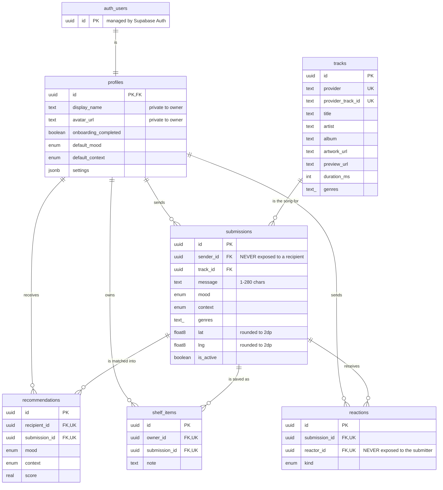

# Vinyl — database

**Owner:** Ivan (`guangyu11`) · **Sprint 1** · Supabase / PostgreSQL

Everything the app stores lives here. This document is the contract the rest of
the team builds against — if something you need is not in the "API surface"
section below, it does not exist yet, so ask rather than querying a table
directly.

| File | Purpose |
| --- | --- |
| `supabase/migrations/20260904000001_schema.sql` | Tables, enums, triggers, indexes |
| `supabase/migrations/20260904000002_rls.sql` | Row level security policies and grants |
| `supabase/migrations/20260904000003_functions.sql` | The RPCs the app actually calls |
| `supabase/seed.sql` | 24 demo submissions across every mood |
| `supabase/seed_demo_users.sql` | Optional fake "stranger" accounts |
| `supabase/tests/smoke_test.sql` | CRUD + privacy checks, self-asserting |

---

## 1. The idea behind the design

The Android app talks to Postgres **directly** over PostgREST with the public
anon key. There is no server of ours in between, so **RLS is the backend**. Two
things follow from that, and they explain most of the schema:

**Anonymity cannot be a UI concern.** We use Google sign-in, so behind every
submission there is a real name, email and profile photo. If a recipient could
`SELECT` a submission row they would get `sender_id`, and from there the
sender's identity. So no user may read another user's rows — ever. Cross-user
reads go through `SECURITY DEFINER` functions that return a column list with no
`sender_id` in it.

**Matchmaking has to run in the database.** A user must not be able to browse
the pool of songs they have not been matched to, which rules out doing the
filtering client-side. `request_recommendations()` is therefore a function, and
Sprint 2's real algorithm slots into its `score` expression without anything
else changing.

Two smaller decisions worth knowing:

- **Coordinates are rounded to 2 decimal places (~1.1 km) by a trigger before
  they are written.** A precise location never exists on disk, so it cannot leak
  even if a policy is later misconfigured. GPS work should send the real fix and
  let the database blunt it.
- **Reaction counts, not reaction rows, go back to the submitter.** Per-reaction
  timestamps could be correlated against when a record was handed out to work
  back to who reacted.

---

## 2. ER diagram



---

## 3. Tables

### `profiles`
One row per account, created automatically by a trigger on `auth.users`. Holds
the onboarding answers, the Sprint 3 settings blob, and the Google name/avatar
**for the owner's own settings screen only**. Readable and writable by its owner
and by nobody else.

### `tracks`
Song metadata cached from the music API, deduplicated on
`(provider, provider_track_id)`. Readable by any signed-in user (it is public
information and carries no link to a person). Written only via `submit_song()`,
so the upsert cannot race.

### `submissions`
One song passed into the pool: the track, a message of 1–280 characters, a mood,
an optional context, genre tags, a coarse location, and `is_active` so a sender
can retract. **The sender can read their own rows; nobody else can read this
table at all.**

### `recommendations`
The matchmaker's output, persisted. This is what lets the record room survive an
app restart, and the `(recipient_id, submission_id)` unique constraint is what
stops the shake gesture from serving the same record twice. Recipients can read
their own rows; **only `request_recommendations()` can write them**, so a client
cannot hand itself a match.

### `shelf_items`
The record shelf. Owner-only, and the insert policy additionally requires that
the submission was actually recommended to you — you cannot shelve a record you
were never given.

### `reactions`
`(submission_id, reactor_id)` is unique, so reacting again updates in place
rather than erroring. **The reactor can read their own rows. The submitter
cannot read this table at all** — that is deliberate and is the Sprint 3
anonymity requirement, enforced in Sprint 1 so no later screen can leak it.

### Enums
`mood_tag`, `context_tag`, `reaction_kind`. Values are listed at the top of
`20260904000001_schema.sql`. Adding one is
`alter type public.mood_tag add value 'wistful';` — values cannot be removed or
reordered, so agree changes with the team first.

---

## 4. API surface

Call these with `supabase.postgrest.rpc("name", parameters)`. Arguments are
passed **by name**, so anything with a default can be omitted.

| Function | Returns | Notes |
| --- | --- | --- |
| `request_recommendations(p_mood, p_context?, p_limit?)` | `room_card[]` | Runs the matchmaker and persists the result. Never returns your own songs or ones you have already seen. An empty pool returns zero rows — that is a normal state, not an error. |
| `get_room(p_limit?)` | `room_card[]` | Replays the current room. Call this on app start instead of re-matching. |
| `get_shelf(p_limit?)` | `room_card[]` | Saved records, newest save first. |
| `submit_song(...)` | `uuid` | Upserts the track and creates the submission in one call. Required: `p_provider`, `p_provider_track_id`, `p_title`, `p_artist`, `p_message`, `p_mood`. |
| `add_reaction(p_submission_id, p_kind)` | `integer` | New total reaction count. Reacting twice updates in place. Fails if the record is not in your room. |
| `get_reactions(p_submission_id)` | `{kind, total}[]` | Submitter only. Counts per kind, no identities, no timestamps. |
| `get_my_submissions(p_limit?)` | rows | "Records I've sent", with reaction totals. |

Saving and unsaving a shelf item is a plain insert/delete on `shelf_items` — no
RPC needed, RLS covers it.

All of these raise `28000` if you are not signed in, and `42501` if you ask for
something that is not yours. Surface those as an error state rather than
retrying.

### `room_card`

The anonymised shape of a song as a recipient sees it. Note the absence of
`sender_id` — that omission *is* the privacy model.

```
recommendation_id, submission_id, message, mood, context, genres,
lat, lng, submitted_at, track_title, track_artist, track_album,
artwork_url, preview_url, reaction_count, saved
```

Kotlin, for `com.example.vinyl.data`:

```kotlin
@Serializable
data class RoomCard(
    @SerialName("recommendation_id") val recommendationId: String,
    @SerialName("submission_id")     val submissionId: String,
    val message: String,
    val mood: String,
    val context: String? = null,
    val genres: List<String> = emptyList(),
    val lat: Double? = null,
    val lng: Double? = null,
    @SerialName("submitted_at")   val submittedAt: Instant,
    @SerialName("track_title")    val trackTitle: String,
    @SerialName("track_artist")   val trackArtist: String,
    @SerialName("track_album")    val trackAlbum: String? = null,
    @SerialName("artwork_url")    val artworkUrl: String? = null,
    @SerialName("preview_url")    val previewUrl: String? = null,
    @SerialName("reaction_count") val reactionCount: Int = 0,
    val saved: Boolean = false,
)
```

```kotlin
suspend fun room(limit: Int = 3): List<RoomCard> =
    Supabase.client.postgrest
        .rpc("get_room", buildJsonObject { put("p_limit", limit) })
        .decodeList()
```

---

## 5. Applying the schema

**Option A — Supabase SQL editor** (no tooling to install; use this if Docker is
a hassle on Windows). Open the project's SQL editor and run, in order:

1. `20260904000001_schema.sql`
2. `20260904000002_rls.sql`
3. `20260904000003_functions.sql`
4. `seed_demo_users.sql` *(optional)*
5. `seed.sql`
6. `tests/smoke_test.sql`

Every file is idempotent, so re-running one while you iterate is safe. Commit
the files either way — the migration files are the schema's source of truth.

**Option B — Supabase CLI.** Preferred once set up: it records what has been
applied in `supabase_migrations.schema_migrations`, so a teammate running
`db push` later only gets the files they are missing. No Docker required —
`db push` connects straight to the remote project. (Docker is only needed for
`supabase start` / `db reset`, which run a full local stack.)

```bash
npx supabase init                                   # creates supabase/config.toml
npx supabase login                                  # browser, one-off
npx supabase link --project-ref ytuwjogmjjcdytibwedl  # prompts for the DB password
npx supabase db push                                # applies supabase/migrations in filename order
```

Install it with `npx` as above, or `scoop install supabase` on Windows.
A global `npm install -g supabase` is **not** supported by the CLI.

`db push` applies migrations **only**. Seeds and the smoke test are not run
against a linked remote project, so finish in the SQL editor (or with `psql`):

```bash
psql "$DATABASE_URL" -f supabase/seed_demo_users.sql   # optional
psql "$DATABASE_URL" -f supabase/seed.sql
psql "$DATABASE_URL" -f supabase/tests/smoke_test.sql
```

If you already applied a migration by hand in the SQL editor, either let
`db push` re-run it (every file is idempotent) or mark it as done without
re-running: `npx supabase migration repair --status applied 20260904000001`.

### Before you run the seed

Every submission needs a real account behind it, and the matchmaker never
recommends you your own song. **Have all four of us sign in through the app
once** before running `seed.sql`, or run `seed_demo_users.sql` first — otherwise
the only signed-in account will own all 24 songs and see an empty room.

### Verifying

`supabase/tests/smoke_test.sql` impersonates a signed-in user (same JWT claim
PostgREST sets, then `set role authenticated`), runs CRUD against every table,
and asserts the two privacy guarantees. It runs inside a transaction that rolls
back, so it leaves nothing behind. A clean run ends with
`=== ALL CHECKS PASSED ===`.

---

## 6. Changing the schema

Never edit an applied migration — add a new file named
`<YYYYMMDDHHMMSS>_what_changed.sql`. Everyone else re-runs the new file only.

`public.room_card` is a composite type, so changing it means dropping the
functions that return it first. The exact drop order is in a comment at the top
of `20260904000003_functions.sql`.

---

## 7. Sprint 1 acceptance criteria

| Criterion | Where it is met |
| --- | --- |
| Tables exist with correct relationships and constraints | `20260904000001_schema.sql` — 6 tables, FKs with explicit delete behaviour, 4 unique constraints |
| Required fields non-nullable, basic validation enforced | `not null` throughout, `check` constraints on message length, coordinate range and lat/lng pairing, enums for mood/context/reaction |
| Sample CRUD queries succeed against each table | `tests/smoke_test.sql`, 12 self-asserting checks |
| Schema documented for the team | This file — ER diagram, table notes, and the RPC contract in §4 |

## 8. Notes for the team

- **Scott:** the `on_auth_user_created` trigger creates the profile row, and the
  migration backfills accounts that already signed in — including yours. Nothing
  to add on the auth side. `profiles.settings` (jsonb) is where the Sprint 3
  settings screen should live.
- **Natalie:** submission is one call, `submit_song()`. Validate a non-empty
  message and a selected song client-side for a good error message; the database
  rejects both anyway, so nothing bad gets stored if a check is missed.
- **Raina:** `room_card` is the exact payload a vinyl card renders from.
  `context`, `track_album`, `artwork_url`, `preview_url`, `lat` and `lng` are all
  nullable — cards need to look right without them.
- **Everyone:** the anon key is public by design and safe in the app (Scott
  already reads it from `local.properties`). The **service_role** key bypasses
  every policy on this page — it must never go near the Android module.
