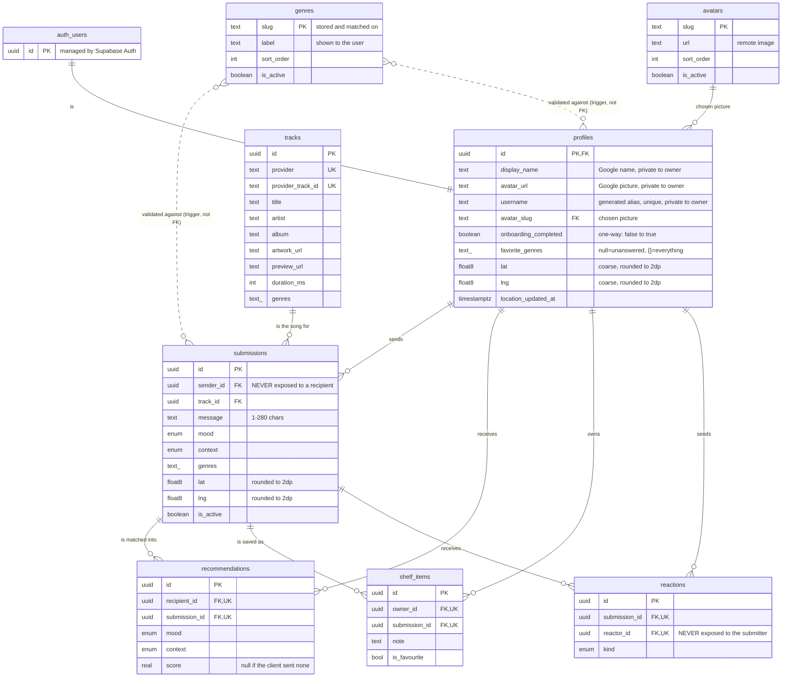

# Vinyl — database

**Owner:** Ivan (`guangyu11`) · **Sprint 2** · Supabase / PostgreSQL

Everything the app stores lives here. This document is the contract the rest of
the team builds against — if something you need is not in the "API surface"
section below, it does not exist yet, so ask rather than querying a table
directly.

| File | Purpose |
| --- | --- |
| `supabase/migrations/20260904000001_schema.sql` | Tables, enums, triggers, indexes |
| `supabase/migrations/20260904000002_rls.sql` | Row level security policies and grants |
| `supabase/migrations/20260904000003_functions.sql` | The RPCs the app actually calls |
| `supabase/migrations/20260918…` – `20260924…` | Sprint 2 profile changes, applied in filename order: profile location, genre lookup, favorite genres, avatars and generated usernames (`20260924000001_usernames_and_avatars.sql`, `20260924000002_user_name_generate.sql`) |
| `supabase/migrations/20261004000001_matchmaking_v2.sql` | The real matchmaker: rewrites the scoring in `request_recommendations`, adds `p_genres` |
| `supabase/migrations/20261004000002_split_matchmaker.sql` | The split path: `candidate_card`, `get_candidates`, `get_genre_weights`, `commit_recommendations` |
| `supabase/migrations/20261005000001_shelf_favourites.sql` | `shelf_items.is_favourite`, for the Collection's Favourites filter |
| `supabase/migrations/20261008000001_cap_genre_weight.sql` | Scales genre rarity to 0–1 in `request_recommendations` and `get_genre_weights`, so genre can never outweigh mood |
| `supabase/seed.sql` | 10 demo accounts and 60 demo records — real iTunes tracks with covers and previews |
| `supabase/tests/smoke_test.sql` | CRUD + privacy checks, self-asserting (30 checks) |
| `docs/matching.md` | How the matchmaker scores and picks, and why |

---

## 1. The idea behind the design

The Android app talks to Postgres **directly** over PostgREST with the public
anon key. There is no server of ours in between, so **RLS is the backend**. Two
things follow from that, and they explain most of the schema:

**Anonymity cannot be a UI concern.** We use Google sign-in, so behind every
submission there is a real name, email and profile photo. If a recipient could
`SELECT` a submission row they would get `sender_id`, and from there the
sender's identity. So no user may read another user's rows — ever. Cross-user
reads go through `SECURITY DEFINER` functions that return a column list with no
`sender_id` in it.

**Matchmaking has to run in the database.** A user must not be able to browse
the pool of songs they have not been matched to, which rules out doing the
filtering client-side. `request_recommendations()` is therefore a function.
The *filter* has to stay on the server; the *ranking* is arithmetic over rows
that are already anonymous, so it may also run on the device (the split path in
§4). The algorithm itself is explained in `matching.md`.

Two smaller decisions worth knowing:

- **Coordinates are rounded to 2 decimal places (~1.1 km) by a trigger before
  they are written.** A precise location never exists on disk, so it cannot leak
  even if a policy is later misconfigured. GPS work should send the real fix and
  let the database blunt it.
- **Reaction counts, not reaction rows, go back to the submitter.** Per-reaction
  timestamps could be correlated against when a record was handed out to work
  back to who reacted.

---

## 2. ER diagram


```mermaid
erDiagram
    auth_users     ||--||  profiles        : "is"
    profiles       ||--o{  submissions     : sends
    tracks         ||--o{  submissions     : "is the song for"
    profiles       ||--o{  recommendations : receives
    submissions    ||--o{  recommendations : "is matched into"
    profiles       ||--o{  shelf_items     : owns
    submissions    ||--o{  shelf_items     : "is saved as"
    profiles       ||--o{  reactions       : sends
    submissions    ||--o{  reactions       : receives
    genres         }o..o{  submissions     : "validated against (trigger, not FK)"
    genres         }o..o{  profiles        : "validated against (trigger, not FK)"
    avatars        ||--o{  profiles        : "chosen picture"

    auth_users {
        uuid id PK "managed by Supabase Auth"
    }
    profiles {
        uuid        id                   PK,FK
        text        display_name         "Google name, private to owner"
        text        avatar_url           "Google picture, private to owner"
        text        username             "generated alias, unique, private to owner"
        text        avatar_slug          FK "chosen picture"
        boolean     onboarding_completed "one-way: false to true"
        text_       favorite_genres      "null=unanswered, {}=everything"
        float8      lat                  "coarse, rounded to 2dp"
        float8      lng                  "coarse, rounded to 2dp"
        timestamptz location_updated_at
    }
    genres {
        text    slug       PK "stored and matched on"
        text    label      "shown to the user"
        int     sort_order
        boolean is_active
    }
    avatars {
        text    slug       PK
        text    url        "remote image"
        int     sort_order
        boolean is_active
    }
    tracks {
        uuid   id                PK
        text   provider          UK
        text   provider_track_id UK
        text   title
        text   artist
        text   album
        text   artwork_url
        text   preview_url
        int    duration_ms
        text_  genres
    }
    submissions {
        uuid    id         PK
        uuid    sender_id  FK "NEVER exposed to a recipient"
        uuid    track_id   FK
        text    message    "1-280 chars"
        enum    mood
        enum    context
        text_   genres
        float8  lat        "rounded to 2dp"
        float8  lng        "rounded to 2dp"
        boolean is_active
    }
    recommendations {
        uuid  id            PK
        uuid  recipient_id  FK,UK
        uuid  submission_id FK,UK
        enum  mood
        enum  context
        real  score         "null if the client sent none"
    }
    shelf_items {
        uuid id            PK
        uuid owner_id      FK,UK
        uuid submission_id FK,UK
        text note
        bool is_favourite
    }
    reactions {
        uuid id            PK
        uuid submission_id FK,UK
        uuid reactor_id    FK,UK "NEVER exposed to the submitter"
        enum kind
    }
```

---

## 3. Tables

### `profiles`
One row per account, created automatically by a trigger on `auth.users`. Holds
the user's generated username and chosen picture, their location and genre
taste, and the Google name/avatar **for the owner's own settings screen only**.
Readable and writable by its owner and by nobody else.

Every preference here is a **real, typed column**. There is deliberately no
free-form `settings` blob: a jsonb bag gives a preference no type, no default
and no `NOT NULL`, and a string key anyone can misspell. If something new needs
storing, add a column — migrations are cheap.

There are no `default_mood` / `default_context` columns. Mood is asked fresh
each day — that question *is* the ritual — and context is not used at all (see
`matching.md` §3).

`favorite_genres` is the one lasting taste preference, set at onboarding. It
holds slugs from `genres` and carries three states in a single nullable column:

| Value | Means |
| --- | --- |
| `null` | hasn't answered yet |
| `'{}'` | answered "I listen to everything" |
| `'{jazz,soul}'` | answered with specific genres |

A trigger rejects any slug not in `genres`, exactly as it does for
`submissions.genres` — so `'K-pop'` fails and `'k_pop'` succeeds. Both `null`
and `'{}'` mean "no genre filter" when matching; the difference matters only for
what the profile screen displays.

Since Sprint 2 it also holds the user's coarse home location — `lat`, `lng`
(a city centroid, rounded to 2dp on write) and `location_updated_at`. Set it
with `update_my_location(p_lat, p_lng)`. There is no continuous tracking: the
value changes only when the user asks it to, and a submission takes a *snapshot*
of it at send time so old records don't move when the sender relocates.

Only coordinates are stored — there is no place-name column. A UI that wants to
show "Melbourne" rather than numbers must reverse-geocode on the client, which
needs network. Offline, show the distance or nothing.

`onboarding_completed` only ever moves from `false` to `true` as far as the app
is concerned: a client that tries to set it back gets `42501`. Reopening
onboarding for testing is a SQL-editor job.

### `profiles.username`
The alias a user is known by, like `Happy Giraffe` or `Sleepy Tiger`. **The
database generates it; the client never supplies one.** Free text is deliberately
not offered — someone could use it to identify themselves, which defeats the
anonymity model.

- **Generated by `generate_username()`.** A random adjective plus a random
  animal from two lists of 60 (3600 combinations). If a name is taken it picks
  again; after 25 misses it appends a 4-digit number (`Happy Giraffe 4821`) so
  signup can never fail because the pool is crowded. That starts happening at
  roughly 85% full, around 3000 users — widen the lists before then if you would
  rather never show numbers.
- **Unique, case-insensitive.** Enforced by the index `profiles_username_uniq`
  on `lower(username)`. Generation takes an advisory lock, so two signups at the
  same instant cannot pick the same name.
- **Assigned by a `BEFORE INSERT` trigger on `profiles`,** whichever way the row
  is created. A client that inserts its own profile with a username of its
  choosing has it overwritten; a client `UPDATE` of `username` is rejected with
  `42501`.
- **Re-rollable during onboarding only,** through `reroll_username()` (see the
  API surface). Once `onboarding_completed` is true the name is fixed.
- **Private.** `profiles` is owner-only under RLS, and no RPC or `room_card`
  column returns a username, so it is never shown to another user or attached to
  a record a recipient sees.
- **Stored exactly as displayed** (`Happy Giraffe`, not a slug). Nothing looks it
  up by key, so there is no slug/label split like `genres` has.
- The word lists live inside the function, so adding words is a new migration
  that re-creates it.

This replaced an earlier pick-from-a-list design (`public.usernames` +
`profiles.username_slug`), which is dropped in the same migration.

### `avatars`
The set of profile pictures a user picks from at onboarding: `slug`, `url`
(pointing at remote storage), `sort_order` and `is_active`. Readable by any
signed-in user, writable by nobody through the API.

`profiles.avatar_slug` holds the choice, with a **real foreign key** — a single
value can have one, unlike the `text[]` genre columns. It is nullable: a user
who skips onboarding has none. Retiring an entry (`is_active = false`) hides it
from the picker but does not invalidate profiles already using it, which is why
the foreign key checks existence rather than activeness. The app filters the
picker itself.

**The table starts empty on purpose** — placeholder URLs would make the feature
look finished while every icon 404s. Until rows are inserted (the migration
comments show the shape), the picker has nothing to offer.

Note this is separate from `display_name` / `avatar_url`, which hold the Google
identity and stay private to their owner.

### `genres`
The controlled vocabulary for `submissions.genres` — `slug` (stored/matched),
`label` (displayed), `sort_order`, `is_active`. **Read this instead of
hardcoding a genre list**; adding one is an `INSERT`, not a migration plus an
app release. Readable by any signed-in user, writable by nobody through the API.

Note this governs the genres a *user picks*. It does not apply to
`tracks.genres`, which is raw iTunes metadata and stays unvalidated.

### `tracks`
Song metadata cached from the music API, deduplicated on
`(provider, provider_track_id)`. Readable by any signed-in user (it is public
information and carries no link to a person). Written only via `submit_song()`,
so the upsert cannot race.

### `submissions`
One song passed into the pool: the track, a message of 1–280 characters, a mood,
an optional context, genre tags, a coarse location, and `is_active` so a sender
can retract. **The sender can read their own rows; nobody else can read this
table at all.**

### `recommendations`
The matchmaker's output, persisted. This is what lets the record room survive an
app restart, and the `(recipient_id, submission_id)` unique constraint is what
stops the shake gesture from serving the same record twice. Recipients can read
their own rows; **only `request_recommendations()` and
`commit_recommendations()` can write them**, so a client cannot hand itself a
match. `commit_recommendations()` takes ids from the client, so it re-checks
every one against the same eligibility rules before writing.

`score` holds what the matcher gave the record, for tuning later. It is null
when the split path commits without scores.

### `shelf_items`
The record shelf. Owner-only, and the insert policy additionally requires that
the submission was actually recommended to you — you cannot shelve a record you
were never given. `is_favourite` is the owner's star in their Collection; it
lives and dies with the row, so taking a record off the shelf unstars it. It is
deliberately not on `room_card` — read it from `shelf_items` directly.

### `reactions`
`(submission_id, reactor_id)` is unique, so reacting again updates in place
rather than erroring. **The reactor can read their own rows. The submitter
cannot read this table at all** — that is deliberate and is the Sprint 3
anonymity requirement, enforced in Sprint 1 so no later screen can leak it.

### Enums
`mood_tag`, `context_tag`, `reaction_kind`. Values are listed at the top of
`20260904000001_schema.sql`. Adding one is
`alter type public.mood_tag add value 'wistful';` — values cannot be removed or
reordered, so agree changes with the team first.

---

## 4. API surface

Call these with `supabase.postgrest.rpc("name", parameters)`. Arguments are
passed **by name**, so anything with a default can be omitted.

| Function | Returns | Notes |
| --- | --- | --- |
| `request_recommendations(p_mood, p_context?, p_limit?, p_genres?)` | `room_card[]` | Runs the matchmaker and persists the result. Never returns your own songs or ones you have already seen. `p_genres` is today's genre **slugs**; leave it out to use `favorite_genres`. `p_limit` is clamped to 1–10. An empty pool returns zero rows — that is a normal state, not an error. |
| `get_room(p_limit?)` | `room_card[]` | Replays the current room. Call this on app start instead of re-matching. |
| `get_shelf(p_limit?)` | `room_card[]` | Saved records, newest save first. |
| `get_candidates(p_limit?)` | `candidate_card[]` | Split path. Eligible records in random order, for ranking on the device. **Read-only — marks nothing as seen.** Default 20, capped at 50. |
| `get_genre_weights()` | `{slug, weight}[]` | Split path. How rare each genre is across the whole pool (IDF), scaled to 0–1: 1.0 is a genre only one record carries. Changes slowly; fetch once per session. |
| `commit_recommendations(p_submission_ids, p_mood, p_context?, p_scores?)` | `room_card[]` | Split path. Records the cards actually shown and returns them. Re-checks every id; ineligible ones are dropped silently. At most 10 ids (`22023` otherwise). |
| `submit_song(...)` | `uuid` | Upserts the track and creates the submission in one call. Required: `p_provider`, `p_provider_track_id`, `p_title`, `p_artist`, `p_message`, `p_mood`. Pass `p_attach_location = true` to snapshot the sender's saved location onto the record. **Does not accept coordinates** — see below. |
| `update_my_location(p_lat?, p_lng?)` | `void` | Sets the caller's coarse home location (onboarding / settings). Call with no arguments to clear it. |
| `reroll_username()` | `text` | Onboarding only. Replaces the caller's username with a fresh unique one, saves it and returns it. Raises `42501` once `onboarding_completed` is true. |
| `add_reaction(p_submission_id, p_kind)` | `integer` | New total reaction count. Reacting twice updates in place. Fails if the record is not in your room. |
| `get_reactions(p_submission_id)` | `{kind, total}[]` | Submitter only. Counts per kind, no identities, no timestamps. |
| `get_my_submissions(p_limit?)` | rows | "Records I've sent", with reaction totals. |

Saving and unsaving a shelf item is a plain insert/delete on `shelf_items` — no
RPC needed, RLS covers it. Starring one is an update of `is_favourite` on the
same row.

Onboarding choices are plain updates to the caller's own `profiles` row, which
RLS confines: `avatar_slug`, `favorite_genres` and `onboarding_completed`
(`false` to `true` only). The one thing the client cannot write there is
`username` — the database owns it.

All of these raise `28000` if you are not signed in, and `42501` if you ask for
something that is not yours. Surface those as an error state rather than
retrying.

### `room_card`

The anonymised shape of a song as a recipient sees it. Note the absence of
`sender_id` — that omission *is* the privacy model.

```
recommendation_id, submission_id, message, mood, context, genres,
lat, lng, submitted_at, track_title, track_artist, track_album,
artwork_url, preview_url, reaction_count, saved
```

Kotlin, for `com.example.vinyl.data`:

```kotlin
@Serializable
data class RoomCard(
    @SerialName("recommendation_id") val recommendationId: String,
    @SerialName("submission_id")     val submissionId: String,
    val message: String,
    val mood: String,
    val context: String? = null,
    val genres: List<String> = emptyList(),
    val lat: Double? = null,
    val lng: Double? = null,
    @SerialName("submitted_at")   val submittedAt: Instant,
    @SerialName("track_title")    val trackTitle: String,
    @SerialName("track_artist")   val trackArtist: String,
    @SerialName("track_album")    val trackAlbum: String? = null,
    @SerialName("artwork_url")    val artworkUrl: String? = null,
    @SerialName("preview_url")    val previewUrl: String? = null,
    @SerialName("reaction_count") val reactionCount: Int = 0,
    val saved: Boolean = false,
)
```

```kotlin
suspend fun room(limit: Int = 3): List<RoomCard> =
    Supabase.client.postgrest
        .rpc("get_room", buildJsonObject { put("p_limit", limit) })
        .decodeList()
```

**`room_card` is frozen at these 16 fields** until every build has
`ignoreUnknownKeys = true` (see §6).

### `candidate_card`

What `get_candidates()` returns: a record offered for ranking but not yet
delivered. Same fields as `room_card` minus `recommendation_id` (no match
exists yet) and `saved` (you can't shelve what you were never given), plus one:

```
submission_id, message, mood, context, genres, lat, lng, submitted_at,
track_title, track_artist, track_album, artwork_url, preview_url,
reaction_count, times_recommended
```

`times_recommended` is how many people have been shown this record, across
everyone. It feeds the fairness term. It is a number, never a list of who.

The Kotlin class is `CandidateCard` in `RoomRepository.kt`.

---

## 5. Applying the schema

**Option A — Supabase SQL editor** (no tooling to install; use this if Docker is
a hassle on Windows). Open the project's SQL editor and run, in order:

1. `20260904000001_schema.sql`
2. `20260904000002_rls.sql`
3. `20260904000003_functions.sql`
4. the later migrations, in filename order
5. `seed.sql`
6. `tests/smoke_test.sql`

Every file is idempotent, so re-running one while you iterate is safe. Commit
the files either way — the migration files are the schema's source of truth.

If the editor reports a syntax error on the very first line, clear the editor
completely, paste again and make sure nothing is highlighted before pressing Run
— the editor runs only the selected text when there is a selection.

**Option B — Supabase CLI.** Preferred once set up: it records what has been
applied in `supabase_migrations.schema_migrations`, so a teammate running
`db push` later only gets the files they are missing. No Docker required —
`db push` connects straight to the remote project. (Docker is only needed for
`supabase start` / `db reset`, which run a full local stack.)

```bash
npx supabase init                                   # creates supabase/config.toml
npx supabase login                                  # browser, one-off
npx supabase link --project-ref ytuwjogmjjcdytibwedl  # prompts for the DB password
npx supabase db push                                # applies supabase/migrations in filename order
```

Install it with `npx` as above, or `scoop install supabase` on Windows.
A global `npm install -g supabase` is **not** supported by the CLI.

`db push` applies migrations **only**. Seeds and the smoke test are not run
against a linked remote project. Run the seed through the Management API (no
database password involved), or paste it into the SQL editor:

```bash
npx supabase db query --linked -f supabase/seed.sql
```

If you already applied a migration by hand in the SQL editor, either let
`db push` re-run it (every file is idempotent) or mark it as done without
re-running: `npx supabase migration repair --status applied 20260904000001`.

### Before you run the seed

`seed.sql` brings its own senders: ten demo accounts
(`vinyl-demo-N@example.invalid`) that can never sign in, each with a home city
(Melbourne x2, Sydney, Brisbane, Perth, Adelaide, Hobart, Auckland, Tokyo,
London) and an avatar. They send 60 records — 6 per mood, 60 different artists,
22 genres, sent over the past 20 days — so every real account is a recipient and
can pull about 20 times before the room runs dry.

Every record is a real iTunes track (US storefront, like the app's search),
stored the way the app stores one: the 100px artwork URL and the iTunes genre on
`tracks`; the sender's mood, genres and message on `submissions`. Preview URLs
can change over time — if one stops playing, search iTunes for that song again
and update its row in the VALUES list.

Running it also deletes the Sprint 1 hand-typed seed (`tracks.provider =
'manual'`, ids `seed-NN`), which had no covers or previews. That cascades to any
room, shelf item or reaction pointing at those records. Records sent from the
app are never touched.

The demo accounts keep `onboarding_completed = false` on purpose: the smoke test
rerolls a record sender's username, which only works while onboarding is open.

### Verifying

`supabase/tests/smoke_test.sql` impersonates a signed-in user (same JWT claim
PostgREST sets, then `set role authenticated`), runs CRUD against every table,
and asserts the privacy guarantees. It runs inside a transaction that rolls
back, so it leaves nothing behind. A clean run ends with
`=== ALL CHECKS PASSED ===`.

**Before every `db push`,** run everything against a throwaway database first:

```
throwaway postgres:16 container, with a stubbed auth schema
  → every migration from scratch    (catches breakage in OLD migrations)
  → seed.sql
  → tests/smoke_test.sql
  → only then: npx supabase db push
```

Wait for the container with a real query, not `pg_isready`. `pg_isready`
answers during initdb's restart cycle, before the database is actually usable.

Seed profiles share the same `created_at`, so `order by created_at limit 1` can
pick a different row each run. Use `order by id` in tests.

---

## 6. Changing the schema

Never edit an applied migration — add a new file named
`<YYYYMMDDHHMMSS>_what_changed.sql`. Everyone else re-runs the new file only.

`public.room_card` is a composite type, so changing it means dropping the
functions that return it first. The exact drop order is in a comment at the top
of `20260904000003_functions.sql`.

**Adding a field to `room_card` breaks older builds.** supabase-kt rejects
unknown JSON keys by default, so any build without `ignoreUnknownKeys = true`
in `SupabaseClient.kt` throws `JsonDecodingException` on every `get_room`,
`get_shelf` and `request_recommendations` call. This was tested, not assumed.
Wait until every teammate has that change, or put the field on a separate type
(as `candidate_card` does).

Migrations run by hand in the SQL editor are **not recorded** in the CLI's
ledger, so `npx supabase migration list` will wrongly show them as pending.
Prefer `db push`. If you did run one by hand, see `migration repair` in §5.

---

## 7. Sprint 1 acceptance criteria

| Criterion | Where it is met |
| --- | --- |
| Tables exist with correct relationships and constraints | `20260904000001_schema.sql` — 6 tables, FKs with explicit delete behaviour, 4 unique constraints |
| Required fields non-nullable, basic validation enforced | `not null` throughout, `check` constraints on message length, coordinate range and lat/lng pairing, enums for mood/context/reaction |
| Sample CRUD queries succeed against each table | `tests/smoke_test.sql`, self-asserting (12 checks in Sprint 1, 30 now) |
| Schema documented for the team | This file — ER diagram, table notes, and the RPC contract in §4 |

## 8. Notes for the team

- **Scott:** the `on_auth_user_created` trigger creates the profile row, and the
  migration backfills accounts that already signed in — including yours. Nothing
  to add on the auth side. The settings screen reads and writes `profiles`
  directly; each preference is its own typed column.
- **Onboarding screens:** read `profiles.username` and show that — never
  `display_name`, which is the real Google name. "Try another name" calls
  `reroll_username()` and shows what it returns; the app never sends a name.
  Pictures come from the `avatars` table (`slug`, `url`, filtered on
  `is_active`) and the choice is saved as `avatar_slug`. Genres come from the
  `genres` table and are saved as **slugs** to `favorite_genres` (an empty array
  means "I listen to everything"; write nothing to leave it unanswered).
  Finishing onboarding is an update setting `onboarding_completed = true`. The
  daily-reminder choice is not in the database: it is stored on the device
  (`ReminderPrefs`), see DesignDecision.md §7.
- **Everyone, before demoing onboarding:** the `avatars` table is empty, so the
  picture step has nothing to show until rows are inserted.
- **Natalie — heads-up, the questionnaire changed:** the daily genre chips now
  read `public.genres` through `DailyGenresViewModel`, start on the user's
  favourites, and are sent as `p_genres`. `GenreOptions.all` is gone. Every
  screen now sends slugs.
- **Natalie:** submission is one call, `submit_song()`. Validate a non-empty
  message and a selected song client-side for a good error message; the database
  rejects both anyway, so nothing bad gets stored if a check is missed.
- **Collection is live.** It reads `get_shelf()` (kept records),
  `get_my_submissions()` (sent) and `shelf_items` (stars and kept-at times).
  "Keep this record" in the receive flow inserts into `shelf_items`.
- **Everyone:** pull the `SupabaseClient.kt` change (`ignoreUnknownKeys =
  true`) as soon as it is merged. Until every build has it, no field can be
  added to `room_card`.
- **Raina:** `room_card` is the exact payload a vinyl card renders from.
  `context`, `track_album`, `artwork_url`, `preview_url`, `lat` and `lng` are all
  nullable — cards need to look right without them.
- **Everyone:** the anon key is public by design and safe in the app (Scott
  already reads it from `local.properties`). The **service_role** key bypasses
  every policy on this page — it must never go near the Android module.